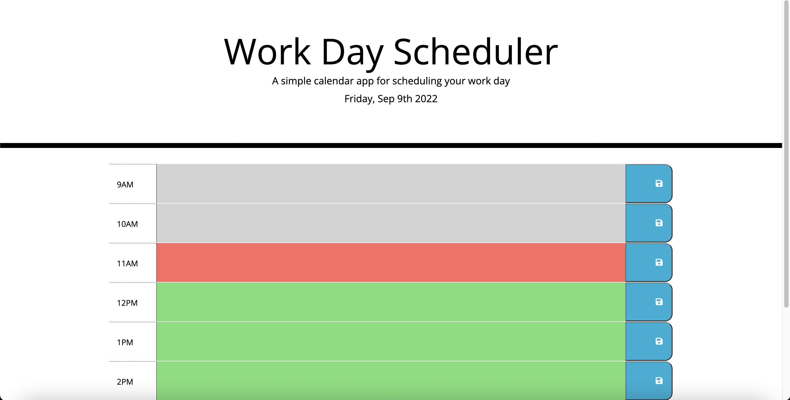
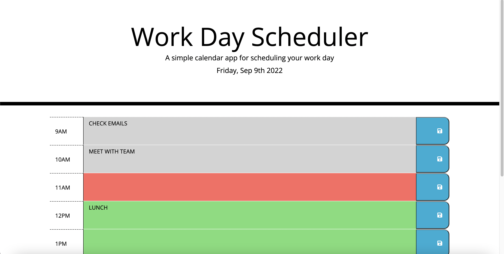

# Work Day Scheduler 

## Description 

This application is a simple work day calendar using [Moment.js] that will allow a user to save events for each hour from 9AM to 5PM. 

## Application Features  

The schedular has the following features: 
* The current date is displayed at the top of the calendar 
* There are timeblocks for each hour from 9AM to 5PM 
* Each timeblock is color coded to indicate whether it is in the past, present, or future
* When you click into a timeblock you can input an event and save it by clicking on the save button for that timeblock using local storage 
* When you refresh the page the saved events will stay on the page

## Mock Up

The following screenshots shows the application functionality: 

## Link to deployed application: https://zeinabhared.github.io/work-day-scheduler/
